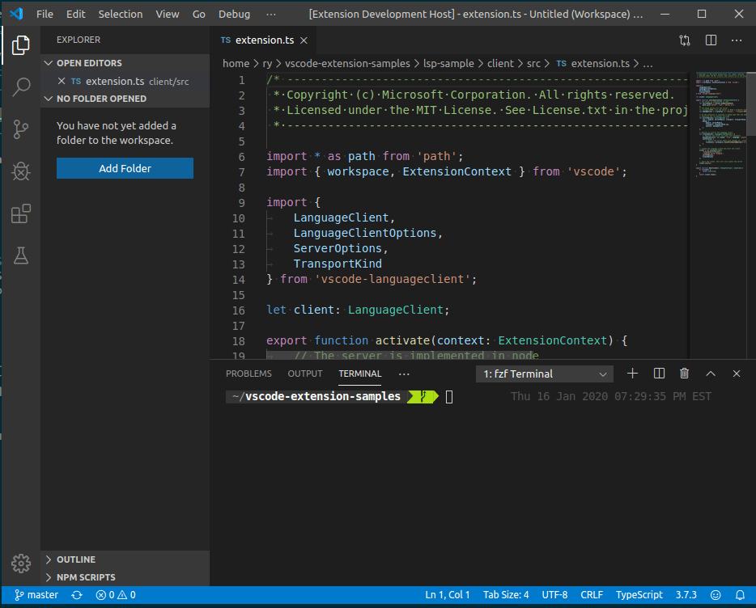

# Basic integration of fzf into vscode to open files and folders
Any time that vscode requires interaction with the OS file dialog, the workflow can become much less efficient. This comes up when opening files outside of your workspace folders or adding a workspace folder. This extension solves that by providing these actions using [fzf](https://github.com/junegunn/fzf).

# Usage
Provides the commands:
* `fzf: Open file using fzf` which opens a terminal in which you can choose a file
* `fzf: Add workspace folder using fzf` to add a workspace folder

On terminal launch, the `pwd` is chosen based on the active editor file.

Bind the commands to keyboard shortcuts to launch faster.

Change the setting `fzf-quick-open.initialWorkingDirectory` to override the initial working directory used for the fzf terminal. Change `fzf-quick-open.findDirectoriesCmd` to change the command used to find directories. Something like `fd --type d` is very fast if you use [fd](https://github.com/sharkdp/fd).

# Setup
1. [Install fzf](https://github.com/junegunn/fzf)
1. For best performance you should set up `fzf` to use the amazingly fast [fd](https://github.com/sharkdp/fd)

	**`~/.config/fish/config.fish`**
	```bash
	set -x FZF_DEFAULT_COMMAND 'fd'
	```

	**`~/.bashrc`**
	```bash
	export FZF_DEFAULT_COMMAND='fd'
	```
1. Configure the setting `fzf-quick-open.findDirectoriesCmd` to use `fd`: `fd --type d`

# Examples
**Open file**


**Open workspace folder**
